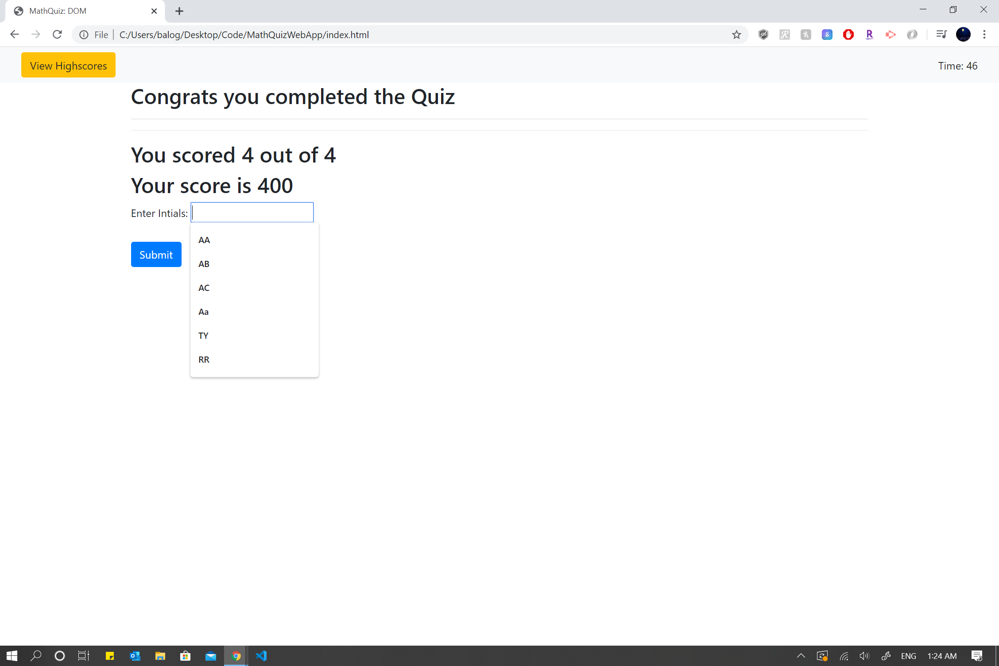
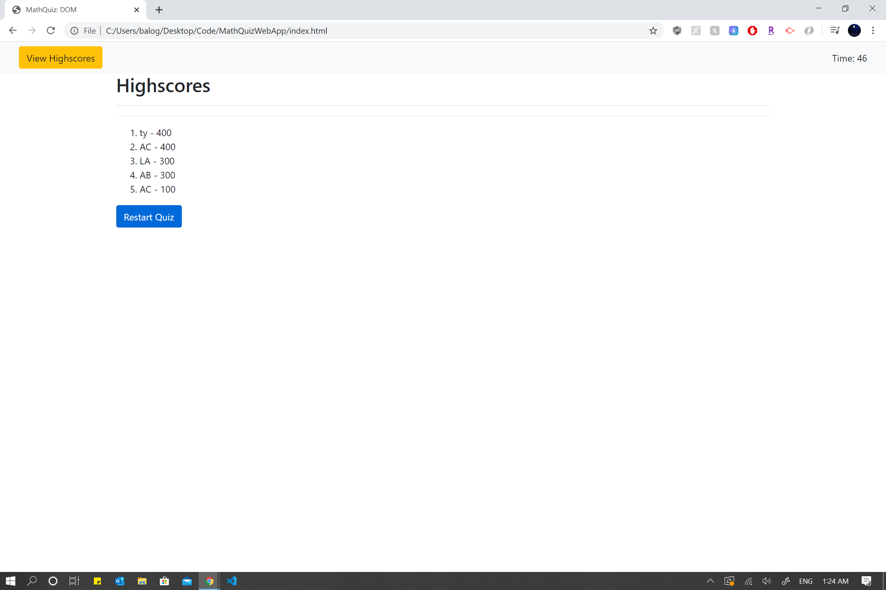
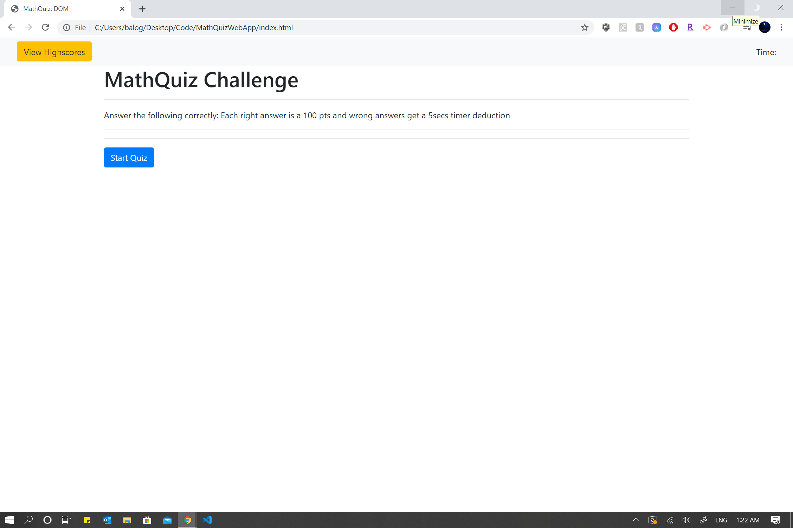
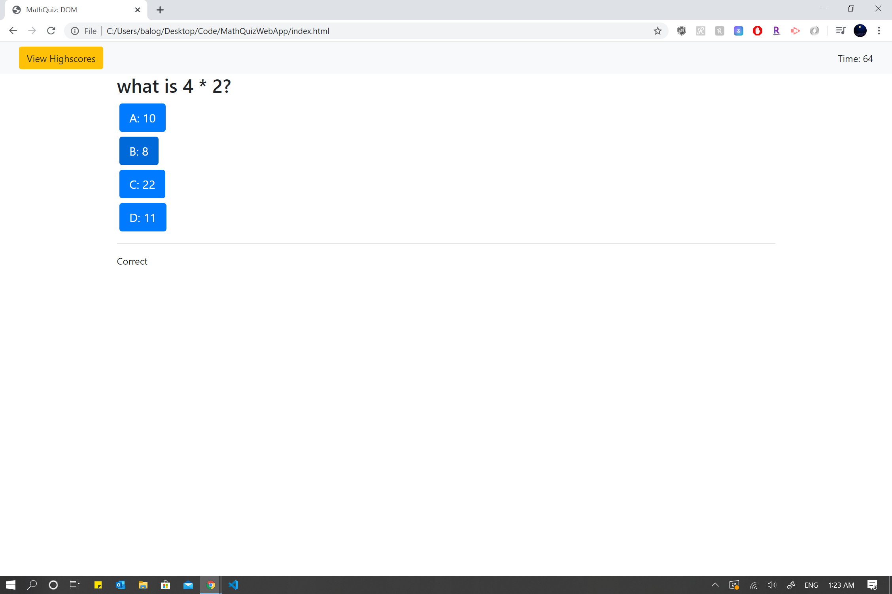

# MathQuizWebApp
Built a code quiz with multiple-choice questions that ranked highscores according to each players highest scores.

# link to MathQuiz
https://toyinbalogun.github.io/MathQuizWebApp/

# Rules of the Quiz
- Each correct answer is 100 point
- Each wrong answer warrants a -5secs deduction off timer
- Once timer is up- quiz is done
- Goodluck!

# Demo Screenshot
# Start Page

# Question Page

# Summary Page

# Highscore Page
